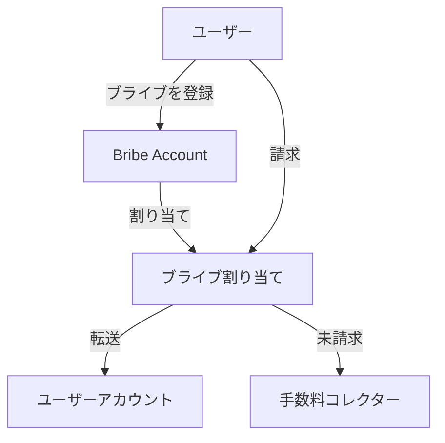

`x/liquidityincentive` モジュールは、特定プールへの投票を誘導した vRISE 保有者にアプリケーションが報酬を出せるプロトコルレベルの仕組みを実装しています。ブライブに基づくインセンティブにより、流動性配分の効率的な市場が生まれます。

## 主な特徴

1. **プロトコルレベルのブライブ:**
   * アプリケーションは、特定プールへ流動性を集めるためにブライブを出せます
   * vRISE 保有者は、より高いブライブがあるプールへ投票する動機を持ちます
   * 流動性配分の効率的な市場が生まれます
2. **エポックベースのシステム:**
   * ブライブは特定のエポックに紐づきます
   * 期限切れエポックを追跡します
   * 期限切れエポックの未請求ブライブは処理され、手数料コレクターへ送られます
3. **ウェイトに基づく分配:**
   * 投票ウェイトに基づく公平な割り当て
   * 二重請求を防止します
   * オンチェーンで透明かつ検証可能です
4. **経済的な効率:**
   * 流動性配分の市場を作ります
   * vRISE 保有者は投票先を選ぶことでリターンを最大化できます
   * 未請求の報酬は手数料コレクターへリサイクルされます

## コア機能

> **注記:** 以降の節は、経験豊富なユーザーまたは開発者向けの高度な内容です。

### ブライブの管理

**各ブライブは次のパラメータで定義されます。**

* `id`: ブライブの一意な識別子
* `epoch_id`: ブライブが有効なエポック
* `pool_id`: ブライブの対象プール
* `address`: 送信者のアドレス
* `amount`: ブライブの総額
* `claimed_amount`: 投票者によってすでに請求された額

### ブライブの割り当て

システムは、ブライブが投票者へどう割り当てられるかを追跡します。

* `address`: 投票者のアドレス
* `epoch_id`: 割り当てが有効なエポック
* `pool_id`: 割り当ての対象プール
* `weight`: 投票者の投票ウェイト
* `claimed_bribe_ids`: すでに請求済みのブライブ ID のリスト

***

## ブライブシステムのアーキテクチャとフロー

### 主要コンポーネントとフロー

#### ブライブの登録

* **ユーザーがブライブを登録する**とき、Liquidity Incentive モジュールの Bribe Account へコインを送ります。
* システムは **Bribe レコードを作成します**（一意な ID、エポック、プール、金額、請求済み金額）。
* エポック開始時に、そのエポックで対象プールに投じられた投票ウェイトに基づき、投票者向けの **ブライブ割り当て** が作られます。

#### ブライブの請求

* **ユーザーが** 自分のブライブ割り当てに対して請求を開始します。
* システムは次を行います。
  * ブライブが存在し、そのエポック／プールで有効かを検証します。
  * ユーザーの割り当てを確認し、未請求であることを確かめます。
  * ユーザーの投票ウェイトに基づいて請求可能額を計算します。
  * Bribe Account からユーザーへ該当額を転送します。
  * 請求済み金額と割り当てレコードを更新します。

#### 手数料処理

* 期限切れエポックの未請求ブライブは **手数料コレクターへ戻されます**。
* 手数料は次のように処理されます。
  * 手数料コレクターからモジュールアカウントへ転送されます。
  * 必要ならボンドデノムへ変換されます。
  * インセンティブとして流動性プールへ分配されます。

#### クリーンアップ（未請求ブライブ）

* 各エポックの終了時に、システムは次を行います。
  * 期限切れエポックを処理します。
  * 未請求のブライブ額を計算します。
  * 未請求資金を手数料コレクターへ戻します。
  * 期限切れのブライブと割り当てレコードを削除します。

#### 状態遷移

* **ブライブ:** 作成 → 有効 → 請求済み／期限切れ
* **割り当て:** 作成 → 有効 → 請求済み／期限切れ
* **資金:** ユーザー → Bribe Account → ユーザー／手数料コレクター

***

### ブライブシステムのフローチャート

**フローの説明:**

1. ユーザーがブライブを登録し、Bribe Account に入金されます。
2. システムは、投票ウェイトに基づいて適格な投票者へブライブ持分を割り当てます。
3. ユーザーはブライブ割り当てから報酬を請求できます。
4. 請求された報酬はユーザーのアカウントへ転送されます。
5. 請求期間後に残った未請求ブライブは、再分配またはバーンのため手数料コレクターへ送られます。

***

## 連携ポイント

ブライブの仕組みは、次のモジュールと連携します。

* コイン転送のための Bank モジュール
* アドレス処理のための Account モジュール
* vRISE 保有者のための Staking モジュール
* パラメータ更新のための Governance モジュール

システムの詳細は [流動性インセンティブ](/learn/sunrise/liquidity-incentive) を参照してください。
