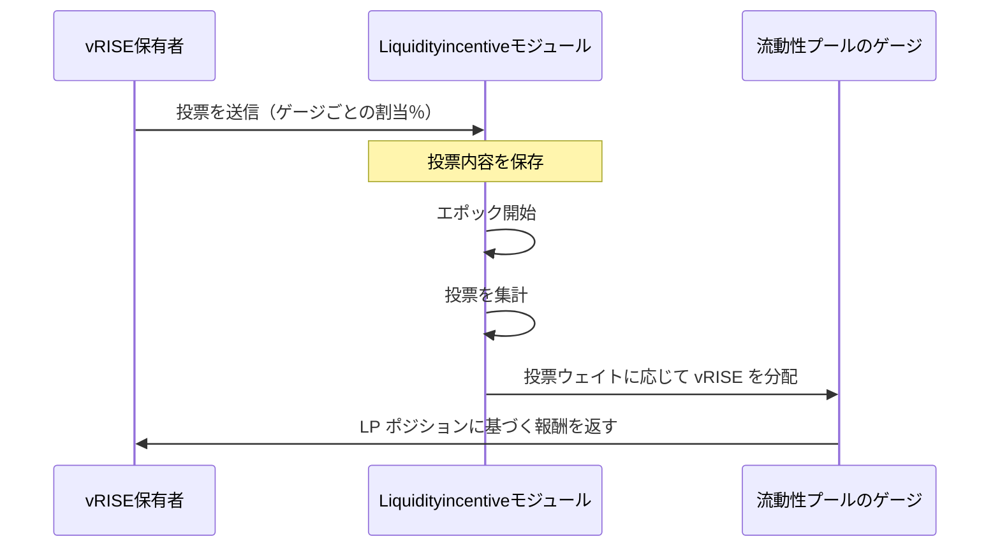

## ゲージとは

Sunrise エコシステムにおけるゲージは、`vRISE` トークンの発行を制御する仕組みです。現在の主要なゲージプロダクトは流動性プールシステムです。

`vRISE` 保有者は、新たにミントされる `vRISE` トークンをどのゲージに割り当てるかを投票で決められます。より多くの投票力を集めた流動性プールほど、新規発行される vRISE の取り分が大きくなり、コミュニティの選好に沿ったインセンティブが生まれます。

## 投票システムの仕組み

> **注記:** 以降の節は、経験豊富なユーザーまたは開発者向けの高度な内容です。

### エポックベースの投票

ゲージのウェイト投票はエポック制で動作します。

* 各エポックは、あらかじめ決めたブロック数にまたがります（ガバナンスで変更可能）
* 投票の集計は、新しいエポックの開始時に行われます
* 投票ウェイトは、エポック開始時点の投票力で決まります
* 新しいエポックが始まると、投票はクリアされます

> **注記:**\
> ここで扱う報酬は、**vRISE の投票力に応じて割り当てられるゲージ投票報酬**です。\
> 通常の LP 報酬とは別物です。\
> 報酬はユーザーのポジションに蓄積され、通常の LP 報酬と同じタイミングで `MsgClaimRewards`（`x/liquiditypool`）から請求できます。

### 参加条件

ゲージ投票に参加するには、次が必要です。

* **トークン要件**: 主にプールへ流動性を提供することで `vRISE` を獲得する必要があります
* **投票力**: バリデーターへのデリゲーションで投票力を得られます
* **集計タイミング:** エポック開始時点の投票力が適用されます

投票力を持つ前でも投票は送信できます。次のエポック開始時に、その時点で持っている投票力に基づいて投票内容が適用されます。

## 投票方法

### ステップ 1: 投票ダッシュボードを開く

**My Votes** をクリックして投票を開始します。

### ステップ 2: ゲージを選ぶ

1. 「Select Pool」をクリックしてプール選択画面を開きます
2. 支援したいプール／ゲージを選びます
3. 以前の投票内容がある場合は自動的に読み込まれます
4. 不要なゲージは削除ボタンで外せます

### ステップ 3: 投票力を割り当てる

選んだ各ゲージに、投票力の何パーセントを割り当てるかを指定します。

* **パーセント指定:** 絶対量ではなくパーセントで指定します。理由は次のとおりです。
  * エポックのあいだに vRISE 残高が変動する可能性がある
  * パーセント指定なら、エポック開始時の残高に自動で追従する
  * 毎エポック投票し直す必要がなくなる

### ステップ 4: プレビューして送信する

1. 「Preview Vote」で、現在の vRISE 残高がどう分配されるかを確認します
2. 選択内容を確認します
3. Vote をクリックしてトランザクションを送信します
4. 投票内容は変更するまで、以降のすべてのエポックに適用されます

### ステップ 5: 更新する（任意）

投票はいつでも変更できます。

* エポック開始前の最新の投票が適用されます
* 変更は次のエポック境界で有効になります
* 投票手順を繰り返すだけで内容を更新できます

システムの詳細は [流動性インセンティブ](/learn/sunrise/liquidity-incentive) を参照してください。
