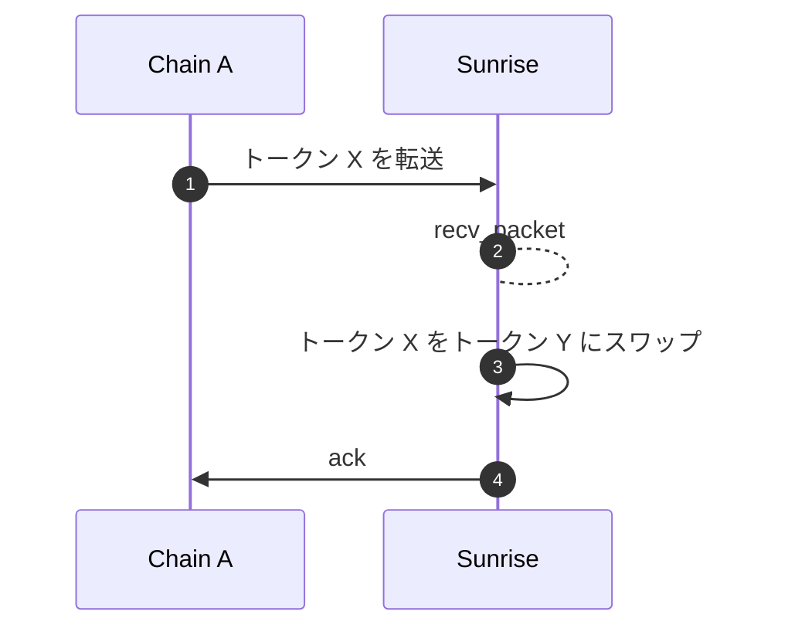
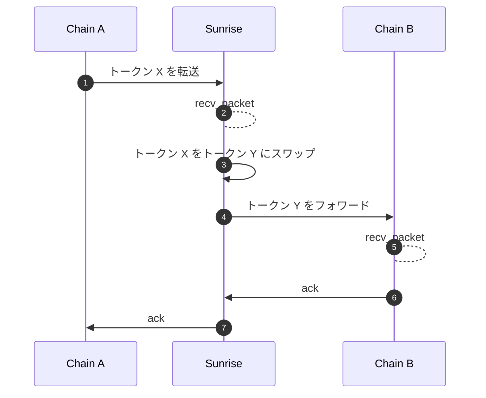
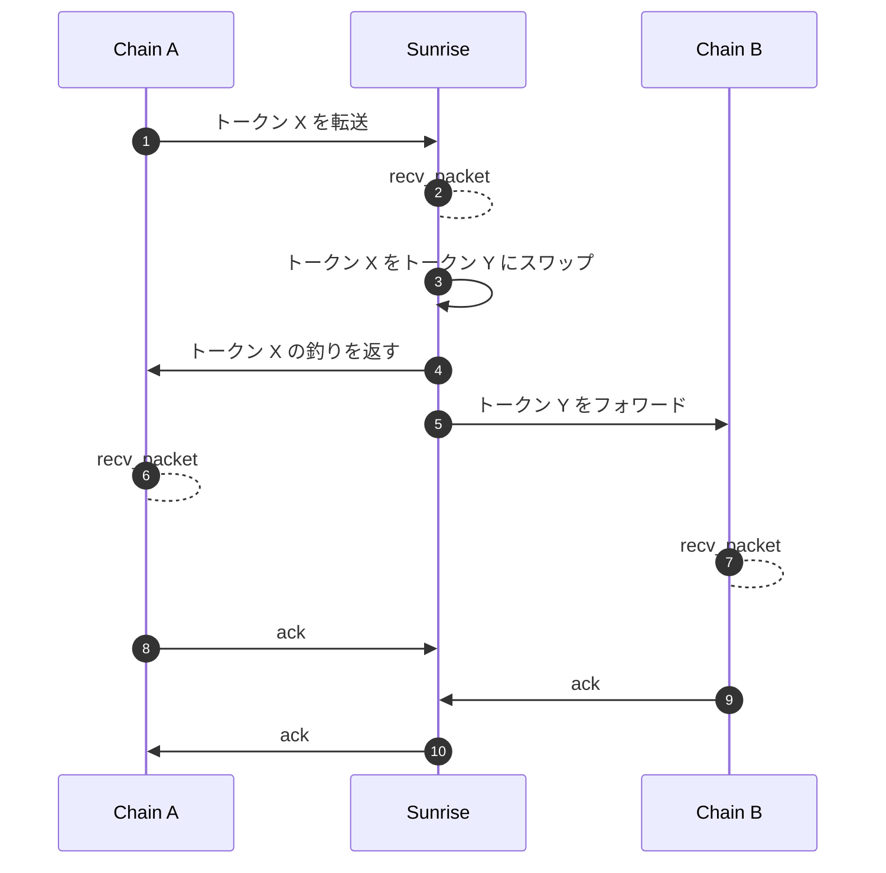

`x/swap` モジュールは、`x/liquiditypool` モジュールの流動性を使ってトークンをスワップする機能を提供します。

## インターフェースプロバイダーの手数料報酬

スワップモジュールの上に作られたフロントエンド、ウォレット、dApp、プロトコルは、手数料を得られます。これにより、Sunrise AMM まわりのオープンで組み合わせ可能な基盤が促進されます。

重要なパラメータは 2 つです。

* **interface\_fee\_rate**\
  スワップ総額から取る、パーセント表記の手数料です。
* **interface\_provider**\
  手数料の送金先アドレスです。アドレスが指定されなければ、インターフェース手数料は取りません。

Sunrise AMM 経由でスワップするとき、手数料の受取先を指定することで **インターフェース手数料を得られ**、トランザクションあたりの収益を最大化できます。この機能は、シンプルなフロントエンドから複雑な金融プロトコルまで、**スワップ出来高を仲介する主体** に報酬を出すために設計されています。

***

### スワップのメッセージタイプ

受け取る量、または送る量を指定するメッセージタイプが 2 つあります。

* **MsgSwapExactAmountIn** - 入力額を指定してトークンをスワップします\
  提供したい入力トークンの正確な量を定義してスワップします。対応する出力は、指定した入力に基づいて計算されます。
*   **MsgSwapExactAmountOut** – 出力額を指定してトークンをスワップします

    受け取りたい出力トークンの正確な量を定義してスワップします。希望する出力を得るために必要な入力額をシステムが計算します。

***

### ルート

> **注記:** 以降の節は、経験豊富なユーザーまたは開発者向けの高度な内容です。

このモジュールは再帰構造の Swap Route をサポートし、連続（Series）または同時（Parallel）の複数ステップからなる複雑なスワップができます。ルートの各ステップは検証され、入出力が正しく扱われるよう処理されます。

```typescript
message RoutePool {
    uint64 pool_id = 1;
}

message RouteSeries {
    repeated Route routes = 1 [
        (gogoproto.nullable)   = false,
            (amino.dont_omitempty) = true
        ];
}

message RouteParallel {
    repeated Route routes = 1 [
        (gogoproto.nullable)   = false,
            (amino.dont_omitempty) = true
        ];
    repeated string weights = 2 [
        (cosmos_proto.scalar)  = "cosmos.Dec",
            (gogoproto.customtype) = "cosmossdk.io/math.LegacyDec",
            (gogoproto.nullable)   = false,
            (amino.dont_omitempty) = true
        ];
}

message Route {
    string denom_in = 1;
    string denom_out = 2;
    oneof strategy {
        RoutePool pool = 3;
        RouteSeries series = 4;
        RouteParallel parallel = 5;
    }
}
```

***

### ICS20 トークン転送のスワップミドルウェア

スワップは ICS20 トークン転送パケットによって自動的に起動できます。IBC Hooks に似ており、ICS20 を使える任意のチェーン（Solidity IBC Eureka、Sei 上の CosmWasm など）の開発者が、IBC ミドルウェア経由でスワップモジュールと連携できます。

#### メタデータ

シリアライズした `PacketMetadata` の JSON 文字列を、ICS20 転送パケットの `memo` フィールドに置く必要があります。

```typescript
type PacketMetadata = {
    [namespace: string]: unknown;
    swap?: SwapMetadata;
};

type SwapMetadata = {
    interface_provider: string;
    route: Route;

    forward?: ForwardMetadata;
} & (
    | {
    exact_amount_in: {
        min_amount_out: string;
    };
}
    | {
    exact_amount_out: {
        amount_out: string;
        change?: ForwardMetadata;
    };
}
    );

type ForwardMetadata = {
    receiver: string;
    port: string;
    channel: string;
    timeout: string;
    retries: number;
    next?: PacketMetadata;
};
```

`ForwardMetadata` は [Packet Forward Middleware](https://github.com/cosmos/ibc-apps/tree/main/middleware/packet-forward-middleware) に由来します。

## **シーケンス図**

> **注記:** 以降の節は、経験豊富なユーザーまたは開発者向けの高度な内容です。

### フォワーディングなしの基本スワップ

このシナリオではトークン転送のあとスワップが行われますが、別チェーンへのフォワーディングはありません。



#### フォワーディング付きスワップ

このシナリオでは、トークンが転送され、スワップされたあと、別チェーンへフォワードされます。



#### 余剰返金とフォワーディング付きスワップ

正確な出力額を指定したスワップでは、余った入力は自動的に返金されます。スワップ後、残りのトークンは別チェーンへフォワードされます。



### 受信アドレスの扱い

スワップ後に後続の釣り返金や転送が失敗しても、「トークン X の転送」の確認は常に成功します。スワップ済みトークンは受信者のアカウントに残ります。

## メッセージ

モジュールは次のメッセージタイプを提供します。

* MsgUpdateParams: モジュールパラメータを更新します（ガバナンス操作）
* MsgSwapExactAmountIn: 入力額を指定してトークンをスワップします
* MsgSwapExactAmountOut: 出力額を指定してトークンをスワップします

## クエリ

モジュールは次のクエリエンドポイントを提供します。

* Params: モジュールパラメータを照会します
* IncomingInFlightPacket: 受信中の in-flight パケットの詳細を取得します
* IncomingInFlightPackets: 受信中の in-flight パケットを一覧します
* OutgoingInFlightPacket: 送信中の in-flight パケットの詳細を取得します
* OutgoingInFlightPackets: 送信中の in-flight パケットを一覧します
* CalculationSwapExactAmountIn: 正確な入力額でのスワップをプレビューします
* CalculationSwapExactAmountOut: 正確な出力額でのスワップをプレビューします

詳細は [Github](https://github.com/sunriselayer/sunrise/tree/main/x/swap) を参照してください。
