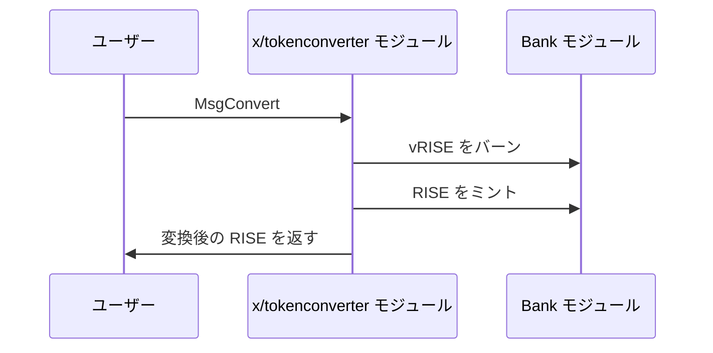

`x/tokenconverter` モジュールは、Sunrise ブロックチェーン上で `vRISE` と `RISE` をシームレスに変換します。ステーキングトークンと手数料トークンを等価のまま切り替えられる点が、このモジュールの役割です。

## 主な特徴

1. **双方向のトークン変換:**

   - `vRISE`（ボンドデノム）を `RISE`（手数料デノム）へ、またその逆へ変換します。
   - トークン間の 1:1 の等価関係を維持します。

1. **パーミッションレスな操作:**

   - 任意のユーザーがいつでも変換できます。
   - 変換にスリッページや手数料はかかりません。

## コア機能

> **注記:** 以降の節は、経験豊富なユーザーまたは開発者向けの高度な内容です。

### トークン変換

モジュールは `vRISE` と `RISE` のあいだで、単純で直接的な変換を提供します。

- vRISE を RISE に変換するとき、モジュールは vRISE をバーンし、同量の RISE をミントします。
- RISE を vRISE に変換するとき、モジュールは RISE をバーンし、同量の vRISE をミントします。（ユーザーは利用できません）

この処理により、システムの経済的な総価値は保ったまま、用途に合ったトークン種別を選べます。

## ワークフロー: トークン変換の流れ

> **注記:** 以降の節は、経験豊富なユーザーまたは開発者向けの高度な内容です。



## メッセージ

モジュールは次のメッセージタイプを提供します。

- MsgUpdateParams: モジュールパラメータを更新します（ガバナンス操作）
- MsgConvert: ボンドデノムと手数料デノムのあいだでトークンを変換します

### MsgConvert

ボンドデノムと手数料デノムのあいだでトークンを変換します。

```go
type MsgConvert struct {
    Sender  string
    Amount  string
}
```

## 利点

1. **柔軟なトークン利用:**

   - 好みのデノムでトークンを保有できます。
   - 用途（ステーキングか手数料か）に応じて切り替えられます。

2. **エコシステム連携:**

   - トークン種別の変換により、DA 手数料抽象化を支えます。
   - Sunrise エコシステムの他モジュールの運用を助けます。

3. **シンプルな設計:**

   - 手数料もスリッページもない直接的な変換です。
   - 理解しやすく、アプリケーションへの組み込みも容易です。

詳細は [Github](https://github.com/sunriselayer/sunrise/tree/main/x/tokenconverter) を参照してください。
